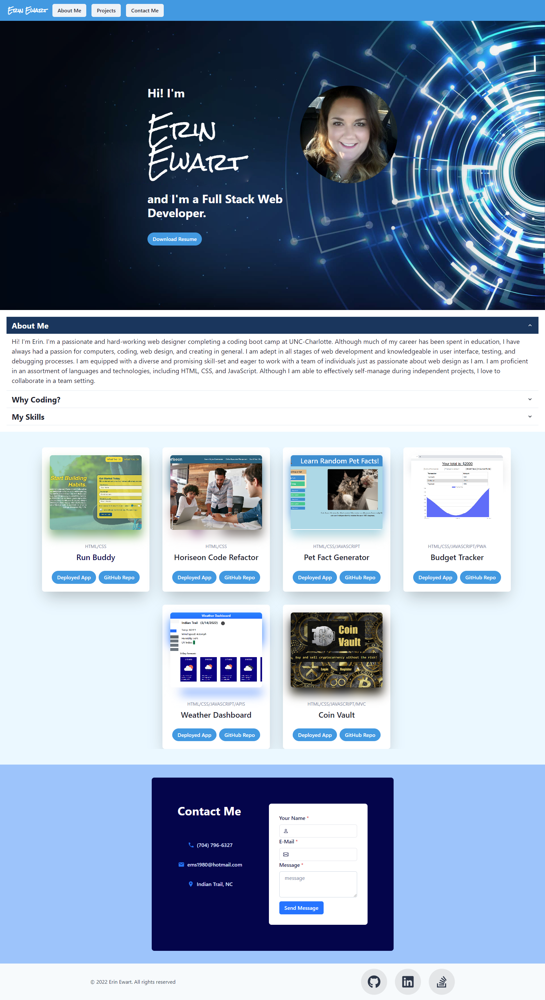

# Erin Ewart's Portfolio
    

## Description

To create my portfolio I used a React application to design a website portfolio to showcase my work to future employers. It includes a section about me, a section with links to my projects, and a section with my contact info. I created a link to my resume, Git Hub, and LinkedIn website. I used Chakra UI components to style my website, make it mobile responsive, and to style the states of different elements. 

## Table of Contents

- [Description](#description)
- [Installation](#installation)
- [Usage](#usage)
- [License](#license)
- [Contributing](#contributing)
- [Tests](#tests)
- [Questions](#questions)

## Installation

The app is deployed using GitHub Pages at
https://uncgirl02.github.io/react-ewart-portfolio/

## Usage

Use the navigation at the top to easily access the "About Me," "Projects," or "Contact Me" sections.  Through my portfolio you can easily download my resume or send me a message through the click of a button! 

## License

This application is covered by the MIT license. 

For more information about this license please visit [https://choosealicense.com/licenses/mit/]

## Contributing

There were no collaborators on this project.

## Tests

No tests written.

## Questions

Find me on GitHub: [https://github.com/uncgirl02](https://github.com/uncgirl02)

Email me with any questions: ems1980@hotmail.com
    
